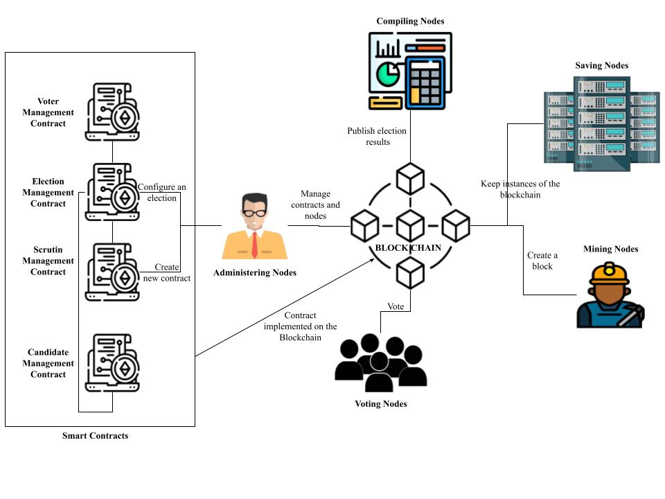

# SyVoElSe_Contracts
SyVoElSe consists of two main components: a semi-public blockchain and smart contracts that enforce various electoral regulations.

## Semi-Public Blockchain

The semi-public blockchain comprises a hierarchy of nodes that serve distinct purposes:

### Types of Nodes

1. **Mining Nodes:** Responsible for block mining operations.
2. **Saving Nodes:** Only some designated nodes will store the database due to the sensitive nature of the data. But access is still public.
3. **Compiling Nodes:** Authorized to publish election results. These nodes represent authorized entities that can proclaim final results, while other nodes can still conduct vote counting and access local results without publicizing them on the blockchain.
4. **Administering Nodes:** Represent Electoral Management Bodies (EMBs). These nodes establish election parameters, execute new contracts, and grant access to other node types.
5. **Voting Nodes:** Include voters and candidates chosen by administering nodes.

## Smart Contracts

The smart contracts within the system are responsible for implementing various electoral regulations:

1. **Election Management Contract:** Defines election parameters and details.
2. **Scrutin Management Contract:** Implements diverse electoral systems. It includes tallying functions that determine the final seat distribution for the respective elections.
3. **Voters Management Contract:** Identifies voters, assigns them to respective districts, manages their voting process, and keeps track of eligible voters.
4. **Candidates Management Contract:** Manages vote delegation processes.

## System Architecture and Evolution

This architecture facilitates the organization of multiple simultaneous elections.
The system's evolution occurs through consensus among administering nodes, as depicted in the figure below.

